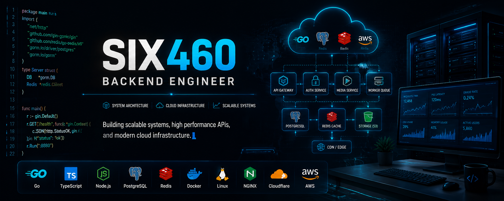
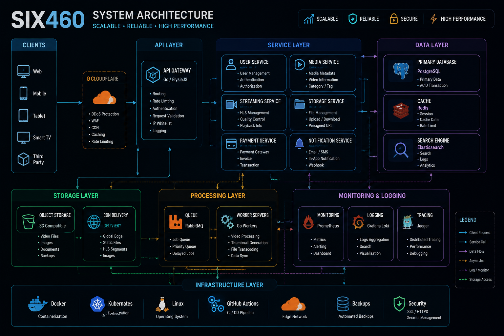

<div align="center">



# SIX460

Backend Engineer

Go • TypeScript • PostgreSQL • Docker • Cloud

</div>

---

## About

I'm a backend developer focused on building web services,
APIs, and infrastructure systems.

My main work:

- Backend services
- API development
- Database design
- Media processing
- Storage systems
- Server deployment

---

## Tech Stack


---

## Projects

### Streaming Platform

Video platform backend focused on media processing and delivery.

Features:

- HLS streaming
- Media processing pipeline
- Storage management
- CDN delivery
- Background workers

Stack:

```
Go
PostgreSQL
Redis
FFmpeg
Docker
HLS
```

---

### API Platform

Backend services designed for maintainable APIs.

Features:

- REST API
- Authentication
- Cache strategy
- Database optimization

Stack:

```
Go
TypeScript
PostgreSQL
Redis
```

---

### Storage Gateway

Object storage management tools.

Features:

- Upload workflow
- File management
- S3 compatible storage
- CDN integration

Stack:

```
Go
S3 API
Docker
Cloudflare
```

---

## System Architecture



---

## Screenshots


---

## GitHub Stats

<div align="center">


</div>

---

## Contact

GitHub:
https://github.com/SIX460
